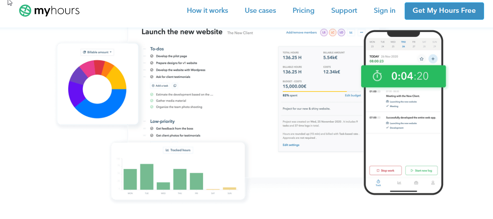

# Myhours

This project has been live at [Netlify](https://gowtham-chokkalingam-makes-great-sites.netlify.app/).

## Myhours

MyHour is task and time tracking website used for tracking live project status.This was an Individual Project. In this I have created on Homepage, Login page with help of React , Chakra and Bootstrap for UI.

 

